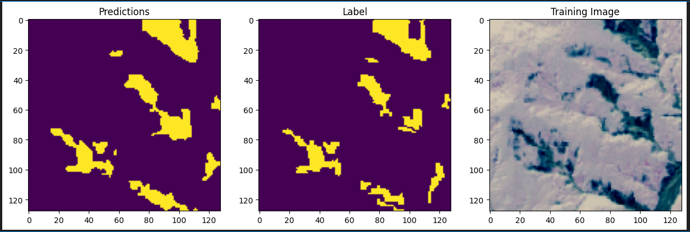

# Projet de Détection des Érosions

## Description
Les érosions menacent gravement les avenues de Kikwit, principale ville économique de la province du Kwilu, sans aucune politique publique pour y remédier. Une étude de l'Institut Supérieur Pédagogique de Kikwit a identifié 425 têtes d'érosion, touchant 365 avenues et détruisant des zones d'habitation, notamment dans les quartiers Kazamba, Lukemi et Kanzombi. Le Boulevard Kanzombi, essentiel pour l'évacuation des produits agricoles, est devenu impraticable, isolant de nombreuses familles. La situation est aggravée par l'absence d'un système de drainage efficace et une urbanisation anarchique. 
Ce projet vise à développer des solutions pour détecter les érosions à l'aide d'analyses d'images de télédétection.

Ce projet vise à détecter les érosions (glissements de terrain) en utilisant des algorithmes innovants appliqués aux images de télédétection. Nous avons répliqué le projet **Landslide4Sense** en utilisant le jeu de données associé.

## Tutoriel Vidéo

Pour une présentation visuelle de notre approche, veuillez consulter ce tutoriel vidéo : [Landslide Detection Tutorial](https://youtu.be/1kl5RNPkz-g)

## Description des Données

Le jeu de données **Landslide4Sense** est divisé en trois parties : formation, validation et test, comprenant respectivement 3799, 245 et 800 patches d'images. Chaque patch d'image est un composite de 14 bandes, incluant :

- **Données multispectrales de Sentinel-2** : B1, B2, B3, B4, B5, B6, B7, B8, B9, B10, B11, B12.
- **Données de pente** de **ALOS PALSAR** : B13.
- **Modèle Numérique de Terrain (DEM)** de **ALOS PALSAR** : B14.

Toutes les bandes du jeu de données sont redimensionnées à une résolution d'environ **10 m par pixel**, et les patches d'image ont une taille de **128 x 128 pixels** avec étiquetage pixel par pixel.

